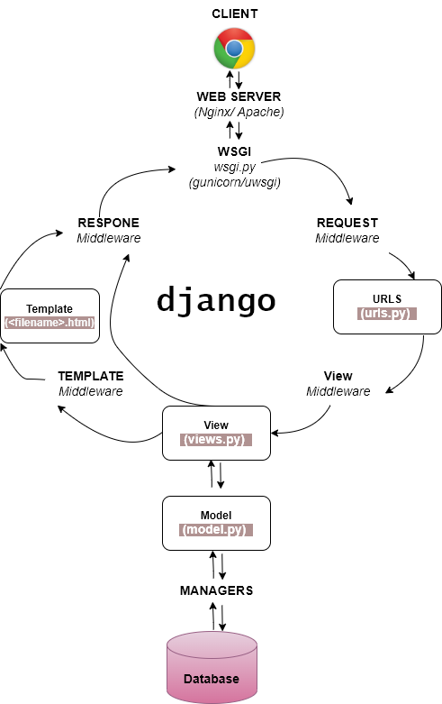

# PBP Django Project Template

Platform-Based Programming (CSGE602022) - Organized by the Faculty of Computer Science Universitas Indonesia, Odd Semester 2022/2023

*Read this in other languages: [Indonesian](README.md), [English](README.en.md)*

Heroku App Link = `https://pbp-task2-ayu.herokuapp.com/katalog/`

## Learning objectives

After completing this tutorial, you are expected to be able to:

1. Understand the chart containing client requests to Django-based web applications and their responses.
2. Knowing the importance of *virtual environment* in making *web* applications based on Django
3. Understand how to create a function in `views.py` which can fetch data from *model* and return it to an HTML.
4. Create a *routing* to map the function you created to `views.py`.
5. Map the data obtained into HTML with the syntax from Django for mapping template data.
6. Do *deploy* the Django application on Heroku.

## Chart of Client Requests to Django-Based Web Applications and Responses



`urls.py` : This is the URL* declaration for the Django project; Contains the URL configuration for the project that we created.

`views.py` : Serves as the main logic of the application that will perform processing of incoming requests

`models.py` : More focused as objects that define entities in the database and their configurations

`html file` : It will contain the mapping that has been defined before being returned to the user as a response

###### The link between the 4 files is in the Django processed request flow:
   1. Requests that enter the Django *server* will be processed via `urls` to be forwarded to the `view`s defined by the developer to process the request.

   2. If there is a process that requires the involvement of *database*, then later `views` will call *query* to `models` and *database* will return the result of the query to `views`

   3. After the request has been processed, the results of the process will be mapped into the HTML that has been defined before finally the HTML is returned to the user as a *response*.

## Importance of Virtual Environment

When a program is run in a Virtual Environment, it has its own modules which external programs cannot access. In other words, Virtual Environment is a tool used to create a virtual python environment that cannot be accessed from the outside world or isolated.

###### The reason why we need *virtual environment*

1. So that each application has its own module
2. Can you specify which version of Django you want to use?

This is useful if we create an application project using django 1.1 then the application will run perfectly using version 1.1, but if the latest version of django is released later, we have to upgrade the module.

But the fact is that the application that has been made does not run with the latest version of the module because of many changes in function and there are also other application projects that are required to use the latest version of the module. Then we need a virtual environment

###### What happens when you don't activate *virtual environment*

We can still create Django-based web applications without using a virtual environment, but the risk is that if we update Django and it turns out that the project we created doesn't support the latest Django, our project can get an error.

## Tutorial: Implementation of Basic Views

#### Create a function in `views.py` that can fetch data from the model and return it to an HTML

   1. Open `views.py` which is in the `catalog` folder and create a function that accepts the `request` parameter and returns `render(request, "catalog.html")`. The example is :

      ```shell
      def show_katalog(request):
         return render(request, "catalog.html")
      ```
   2. Create a folder named `templates` in the application folder `catalog` and create a file named `catalog.html`. The contents of `katalog.html` can be filled by the following *templates.

      ```shell
      

      
      <h5>Name: </h5>
      <p>Fill me!</p>

      <table>
         <tr>
         <th>Item Name</th>
         <th>Item Price</th>
         <th>Description</th>
         </tr>
          Add data below this line 
      </table>

      
      ```

#### Create a route to map the created function to `views.py`.
   
   1. Create a file in the `catalog` application folder named `urls.py` to do *routing* the `views` function that has been created so that later HTML pages can be displayed via your *browser*. The contents of the `urls.py` are as follows.

      ```shell
      from django.urls import path
      from catalog.views import show_katalog

      app_name = 'catalog'

      urlpatterns = [
         path('', show_catalog, name='show_catalog'),
      ]
      ```

   2. Also register the `catalog` application into `urls.py` which is in the `project_django` folder by adding the following code snippet to the `urlpatterns` variable.

      ```shell
      path('catalog/', include('catalog.urls')),
      ```

   3. Run your Django project with `python manage.py runserver` command and open `http://localhost:8000/catalog/` in the browser to see the created page.

## Tutorial: Connecting Models with Views and Templates

#### Map the retrieved data into HTML with the syntax from Django for template data mapping.

   1. In the created *views* function, import the previously created *models* into the `views.py` file. You will use the *class* to retrieve data from the *database*. Examples are:

      ```shell
      from django.shortcuts import render
      from catalog.models import CatalogItem
      ```

   2. Add the code snippet below into the previously created `show_catalog` function. This code snippet serves to call the *query* function to the *database model* and store the results of the *query* into a variable.

      * You can change the Variable Sis Cinoy according to the name you want *

      ```shell
      data_goods_catalog = CatalogItem.objects.all()
      context = {
         'list_goods': data_goods_catalog,
         'name': 'Sis Cinoy'
      }
      ```

   3. Add `context` as the third parameter to the return of the *render* function in the function you created earlier. The data contained in the `context` variable will also be rendered by Django so that later you can display the data on an HTML page.
   
      ```shell
      return render(request, "catalog.html", context)
      ```

 To do this mapping, you can use the special template syntax found in Django, namely `{{data}}`.

   1. Open the HTML file that was created earlier in the *templates* folder in the catalog directory.

   2. `Change Fill me!` in HTML tag `<p>` to `{{name}}` to display your name in HTML page. Examples are:

      ```shell
      <h5>Name: </h5>
      <b>{{name}}</b>
      ```

3. To display a list of items into a table, you need to iterate over the `list_goods` variable that you have rendered into the HTML. Note that you cannot call the item list directly like you did in step 2 because the `list_item` variable is a container containing objects. You also need to call the specific variable/attribute name of the object in the container to call the data from that object. Examples are:

   ```shell
    Add data below this line 
   
      <tr>
         <th>{{item.name_item}}</th>
         <th>{{item.price_item}}</th>
         <th>{{item.description}}</th>
      </tr>
   
   ```

Now, try to *refresh* the page, if the changes appear then congratulations! You have successfully connected `models` with `views` and `templates` while learning the basics of Django's *template* syntax.

Next, please `add`, `commit`, and `push` the changes you have made to save them to the GitHub repository.


## Tutorial: Deploy Django App to Heroku

#### Do *deploy* to Heroku the application that has been made so that later it can be accessed by your friends via the Internet.

In this template, deployment is done by utilizing GitHub Actions as the _runner_ and Heroku as the application hosting platform.

   1. Create a Heroku app with the name you want

   2. Open your GitHub repository configuration and go to the Secrets section for GitHub Actions (`Settings -> Secrets -> Actions`).
   
   3. Add a new `repository secret` variable to do *deployment*. The Name-Value pair of the variables that you will create you can take from the information you noted in the previous text file. Examples are as follows.

   ```shell
   (NAME)HEROKU_APP_NAME
   (VALUE)MY-APPLICATION
   ```
4. Enter the Heroku application that has been created then click the Deploy icon available

   5. Scroll down and click *connect to Github* to connect the Heroku app with your Github.\

   6. Click deploy at the bottom after *connect to Github*

   7. Go to the GitHub Actions tab and rerun the failed workflow.

After your workflow is restarted and the deployment status is successful (you can see there is a green check symbol in your repository), you can access your application at https://<heroku-application-name>.herokuapp.com. Happy! Now your Django application is accessible on the Internet.

## Credits

This template is based on [PBP Odd 2021](https://gitlab.com/PBP-2021/pbp-lab) written by the 2021 Platform-Based Programming Teaching Team ([@prakashdivyy](https://gitlab.com/prakashdivyy )) and [django-template-heroku](https://github.com/laymonage/django-template-heroku) written by [@laymonage, et al.](https://github.com/laymonage).

[Heroku]: https://www.heroku.com/
[Visual Studio Code]: https://code.visualstudio.com/
[PyCharm]: https://www.jetbrains.com/pycharm/